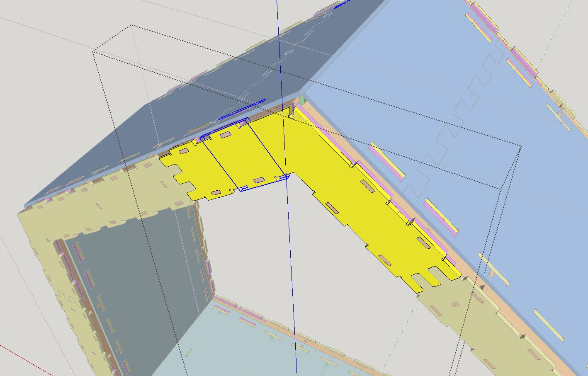

# Wikihouse porting tutorial
{{TutorialInfo
|Topic= Wikihouse porting tutorial
|Level= Intermediate/Advanced
|Time= 60 minutes
|Author=
|FCVersion=
|Files=
}}

## Introduction

This tutorial will show you how to convert _ tools in FreeCAD. The result is a full copy of the original SketchUp file, except that it has become fully parametric. The level of parametricism of the final file depends on the work you spend on it, as explained below. But it is totally possible to do things step by step, and rebuild the Wikihouse file rather quickly, and leave the more lengthy conversion of base profiles to sketches for later.

This tutorial will require intermediate knowledge of FreeCAD, that is, you are able to find your way between the different workbenches and tools, are already able to model simple objects, and, above all, are comfortable with [Draft Move](Draft_Move.md) and [Draft Rotate](Draft_Rotate.md). It will use mostly Draft and Arch tools, but knowledge of the Sketcher will become necessary when converting the base profiles to sketches.

Since the Wikihouse project is open by nature, files are easy to find on the project website, but also on the [SketchUp 3D Warehouse](https://3dwarehouse.sketchup.com/search.html?q=wikihouse&backendClass=both) or in the project\'s [github repositories](https://github.com/wikihouseproject). The preferred format used by the project is Sketchup, so most of the files you\'ll find are in that format.

In the following tutorial we used the [Chassis](https://github.com/wikihouseproject/Microhouse/blob/master/microhouse_0.5_chassis.skp) file from Wikihouse\'s Microhouse subproject.

## Preparing the Sketchup file 

The first thing you will need to do is to open the file in SketchUp and delete everything you don\'t want to export. We will only export one section of the Microhouse, so everything else must be deleted.

  

The Wikihouse elements, in SketchUp, are made in a specific way: By adding small \"pieces\" together in order to create the different components:

  

This is not how we will proceed in FreeCAD. Since one of the most powerful features of FreeCAD is [Constrained Sketches](Sketcher_Workbench.md), we\'d better take advantage of this, and base all our Wikihouse elements on Sketches. That way, modifying any part can be done in the Sketcher, which is much more comfortable.

In order to turn our SketchUp objects into FreeCAD sketches, which can then be used to create [Arch Panel](Arch_Panel.md) objects, we need to extract one, flat face from each wikihouse piece. The thickness will be re-added later, in FreeCAD, directly in the Arch Panel properties. This way, we will keep it parametric as well. To turn each wikihouse component into a single, flat face, enter each component by double-clicking it, then select each sub-component, and right-click → Explode, until all sub-components are exploded, and your component is composed only of faces and edges:

  

Once this is done, select everything in your component, and unselect, by Shift + double-clicking them, each frontal face of your component. Be sure to double-click instead of single-click, because otherwise you will only unselect the face and not its border edges (which we will need to keep as well). After that, we will have unselected everything we want to keep, so we only need to press the delete key. Now our component is only one big flat face.

  

Repeat this for each component. Since many are duplicated, this is not as huge a task as it looks. Besides, if you are not familiar with the Wikihouse system, this step will give you a pretty good understanding of how it works.

When our piece of house is fully made of flat elements, we can select everything and export it to a .dae file, and then import this file into FreeCAD. Be sure to mark the \"triangulate all

## Solving the double faces bug 

There is a nasty problem for which I haven\'t found a better solution: Meshes exported from SketchUp to the .dae format have their faces duplicated. Each face becomes actually two faces. The easiest way I have found so far is to open the exported file in [Blender](http://www.blender.org) for repair:

1.  Open the dae file in Blender (**File → Import → Collada**)
2.  Select a component, and hit **TAB** to enter edit mode
3.  Press **A** to deselect everything, then **A** again to select everything
4.  Press **W** → Remove doubles
5.  Press **TAB** to exit edit mode
6.  Repeat for all the components
7.  Save a new dae file (**File → Export → Collada**)

Normally the above operation shouldn\'t change the scale, but it is always wise to verify, using the measuring tools, that the imported geometry is at correct scale before going further. You might need to tweak Blender\'s Collada export settings if needed.

## Importing and converting to wires 

Note that it might be easier to go by parts and treat + export objects group by group, as we did below, we exported only the first layer, made of yellow elements in SketchUp. These elements will come into FreeCAD as [Mesh](Mesh_Workbench.md) objects:

  

The next step is to create wires from each of our meshes. There is a convenient Macro named [Macro Extract Wires from Mesh](Macro_Extract_Wires_from_Mesh.md) that does just that. Install it (Refer to the [Macros](Macros.md) page for instructions), then one by one (you can do them all at once, but this macro takes some time), convert all our meshes to wire objects:

  

We could now already make _ tool, but these will be rather heavy sketches, and might not be very manageable on a slow machine, or we could turn each individual wire (the outline and each hole) of the sketch into a separate sketch. This would allow us, for example, to reuse a typical hole, make it only once, then duplicate it with [Draft Clone](Draft_Clone.md) to make the other holes. This way, you would only need to edit one to edit them all.

The Extract Wires from Mesh macro also sometimes fails in finding closed wires inside a mesh, which will not produce correct Panels. An easy procedure to recompose the wires of a component is this:

1.  Select the component, optionally hide everything else to see better
2.  [Draft Downgrade](Draft_Downgrade.md) it. It will be exploded into a series of individual edges
3.  Start selecting the holes with Ctrl or by using Shift + B to box-select
4.  Press [Draft Upgrade](Draft_Upgrade.md) to turn back each hole into an individual wire
5.  Finally select all the remaining individual edges in the tree, which form the outline, and [Draft Upgrade](Draft_Upgrade.md) them
6.  Select **Part → make Compound** to join back all these wires into one object
7.  Select the compound and press the [Arch Panel](Arch_Panel.md) button

  

There are many possible strategies here, depending on how editable and precise you need the result. The [Arch Panel](Arch_Panel.md) object needs a base object made of wires. It doesn\'t matter how this object is made, if it is a single sketch, or, like in the example above, a compound of different sketches or draft object.

## Converting to Sketches 

It is also possible to do that part later, you could already create Panels from each of the component, but let\'s see already how to to convert a wire-like object to a sketch:

1.  Create a copy of your wire-like object with **Ctrl**+**C**, **Ctrl**+**V**. This is so we can modify it but still keep one in its correct location
2.  Move and rotate it so it lies in the XY plane, using [Draft Move](Draft_Move.md) and [Draft Rotate](Draft_Rotate.md). This is not indispensable, but the next point sometimes fails otherwise
3.  Use [Draft Draft2Sketch](Draft_Draft2Sketch.md) to turn the wire into a sketch. Be warned, this can fail or take a very long time for huge wires. It is best to decompose your object into individual wires as shown above.
4.  If the command above fails, using [Draft Upgrade](Draft_Upgrade.md) twice on a wire-like object, to convert it to a Face then to a [Draft Wire](Draft_Wire.md), before using [Draft Draft2Sketch](Draft_Draft2Sketch.md), usually works better, because the Draft Wire keeps a better track of the order of vertices inside a wire.
5.  Curves are made of several small segments. They can be left as is, but they introduce a lot of endpoint constraints. It is better to replace them by arcs. It is fairly easy to do, just delete the small segments and replace them by an arc. The arc can then be made tangential to the neighbouring segments, but make sure the position of those segments is locked before doing this, as this operation will make them move.
6.  If you worked with several sketches, make a [Part Compound](Part_Compound.md) of them
7.  Create an [Arch Panel](Arch_Panel.md) from it
8.  Rotate/move it back into position with [Draft Move](Draft_Move.md) and [Draft Rotate](Draft_Rotate.md)

  

## Rebuilding the wikihouse and exporting cut sheets 

Also, make sure you don\'t redo any duplicated part. Instead, select the [Draft Clone](Draft_Clone.md) tool to duplicate parts based on the same profile, so they will all share one same profile object. Then, since we have the outline at the correct place to use as a guide, it is fairly easy to rotate and move the clone into its correct position with [Draft Rotate](Draft_Rotate.md) and [Draft Move](Draft_Move.md).

After a while, all our Microhouse section is done.

  

We can now easily create the cut sheets, which are DXF files that will be sent to the shop that will cut the actual panels. The easiest way to do this is to select everything in your document with **Ctrl**+**A**, and then use the [Arch Panel Cut](Arch_Panel_Cut.md) tool. This will produce one Panel Cut object for each Panel object found in the selection. By moving them apart, we get a clear view of all our pieces:

  

We must then \"nest\" our pieces, that is, move and rotate them so they occupy as much as possible to space of a given panel, to generate as little material loss as possible. This operation unfortunately needs to be done by hand, but if you are using a Wikihouse project that already has produced cut sheets, copying them goes pretty fast:

1.  To make sure everything will stay in the XY plane, it is advised to set the [Working Plane](Draft_SelectPlane.md) to XY (top)
2.  Create an [Arch Panel Sheet](Arch_Panel_Sheet.md)
3.  Give it the desired width and height values (Wikihouses are typically printed on 122x244cm plywood sheets)
4.  Move it to a convenient place with [Draft Move](Draft_Move.md)
5.  Optionally, set its margin values to help you position the cut pieces
6.  Move and rotate the individual [Arch Panel Cut](Arch_Panel_Cut.md) objects so they fit inside the Panel Sheet
7.  When you are more or less ready, select the Panel Sheet, and double click it in the tree view to enter Edit mode
8.  Select all the Panel Cuts you wish to insert in it (you may want to switch the tree view to the \"project\" tab to select in the tree)
9.  Select the \"group\" section in the Panel Sheet\'s Task view
10. Press the **Add** button
11. Press the **OK** button

In the Panel Sheet\'s Task view, there is also a button that allows you to move the individual Panel Cuts after they\'ve been inserted inside the sheet. After a while, we have our sheets ready:

  

The last step is simply to select all the sheets, then export them to DXF from menu File → Export. The sheets contents will be exported separated in different layers, with the same color coding commonly used by the Wikihouse project:

  

These files are ready to send to the shops that will do the actual cut. It would be possible to generate the G-Code to be sent to the CNC machine directly from FreeCAD too, but that is matter for another tutorial.

---
[documentation index](../README.md) > Wikihouse porting tutorial
